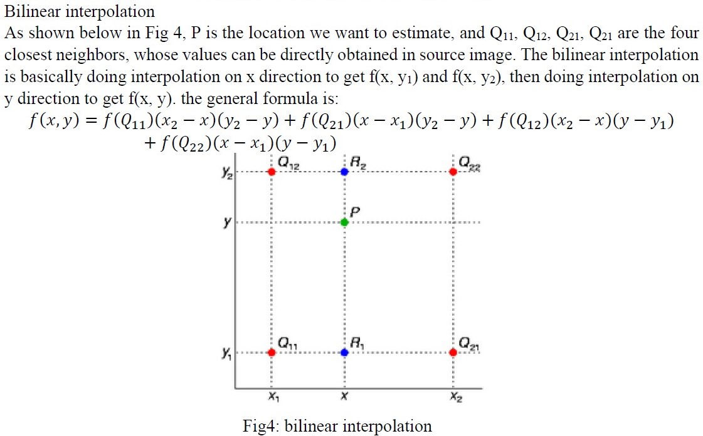
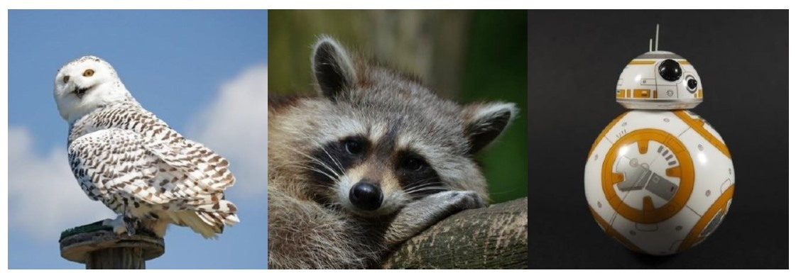
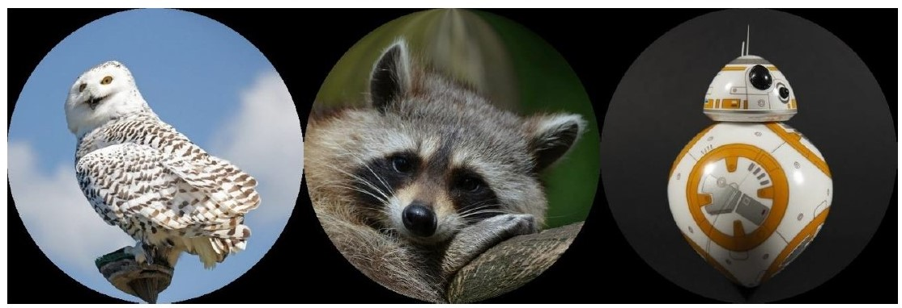
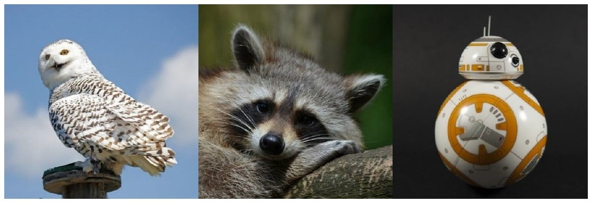
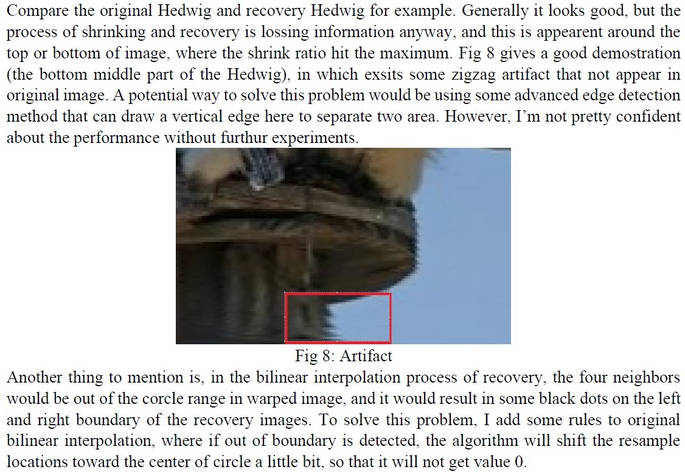

# Image Geometric Warping
 
This project warps square images round and recover them back to square shape again with bilinear interpolation.

### Bilinear interpolation

### Result

Original:

After geometric warping:

Recovery:

-----

